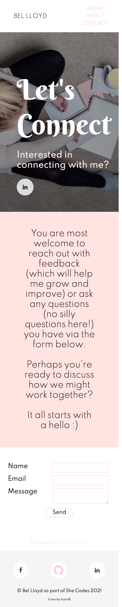

# Portfolio Project

## Live Site Link

[Live Portfolio](https://bel-lloyd.github.io/)

## Wireframes

- Created in Balsamiq to give basic layout I was looking for on desktop;

### Typography

- Spartan is main text font imported from Google fonts
- Sans serif is back up 

### Brand Colours

- mistyrose
- whitesmoke
- black
- white

## Screenshots

- Desktop Screenshots
    - Homepage
    
    - About page
    
    - Contact page
    
- Mobile Screenshots
    - Homepage
    
    - About page
    
    - Contact page
    

## Future Improvements

- Add hamburger menu item using JS
- Include JS slider for projects
- Flex box in CSS for my project work rather than columns
- Speaking section with Webinars and Keynotes included
- Download CV section - Done :)